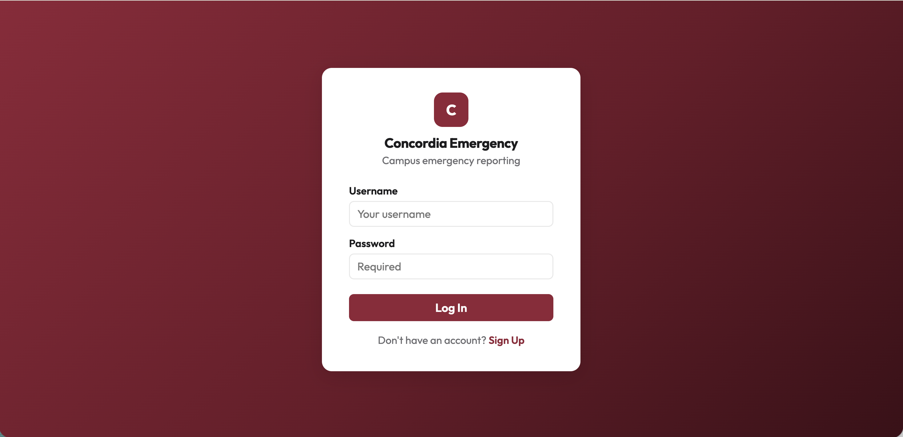
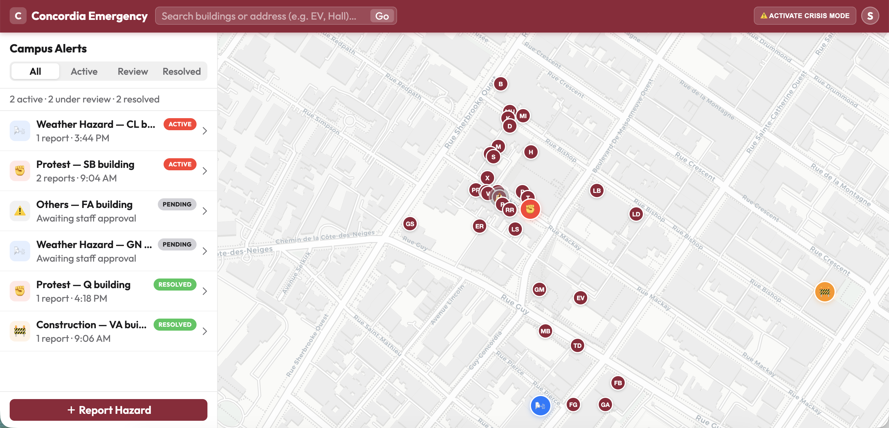
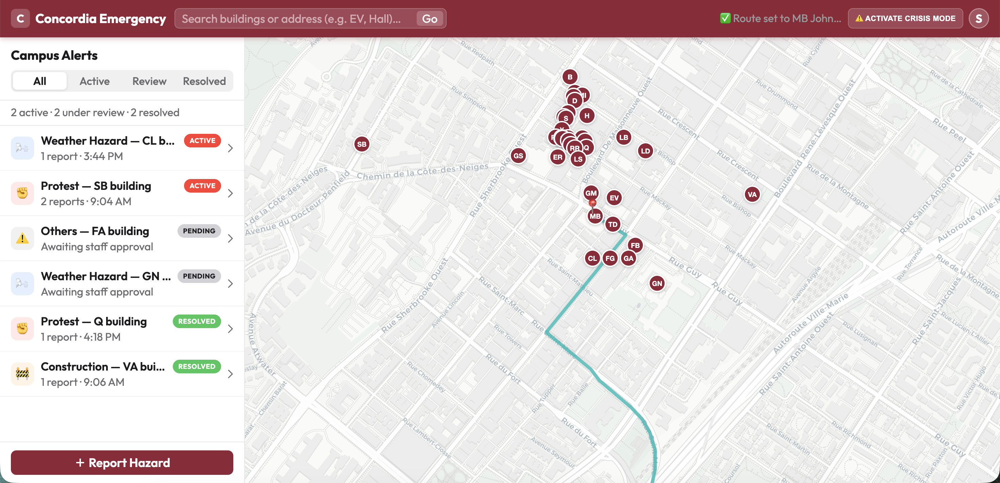
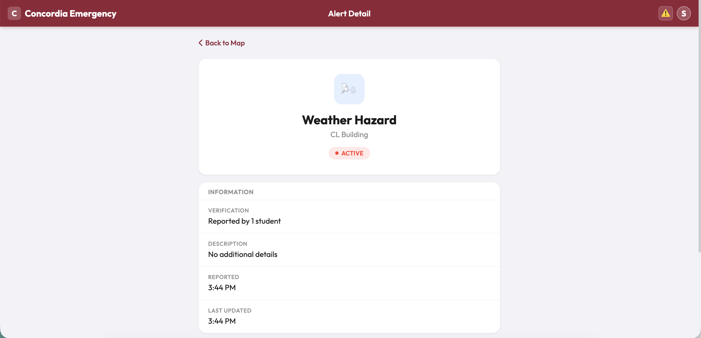
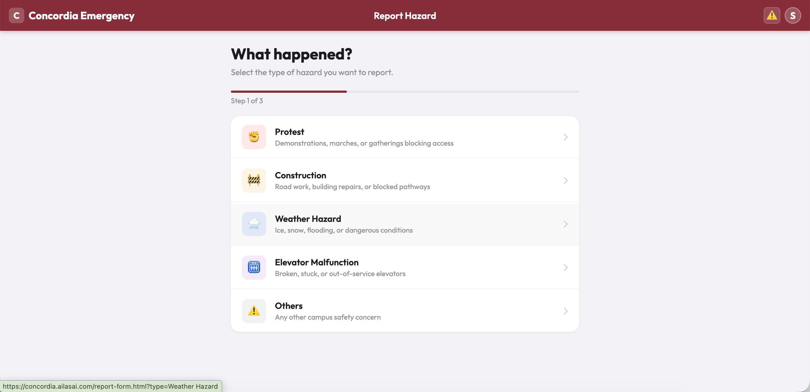
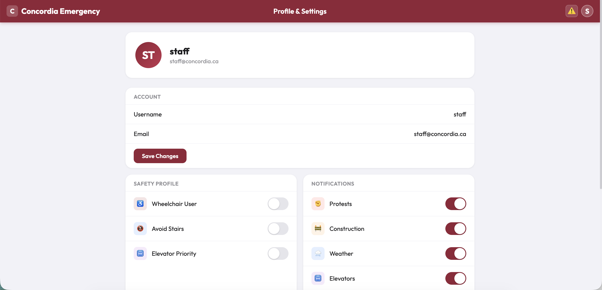

# Concordia Emergency 🚨
### Campus Safety & Navigation Platform

> Real-time hazard reporting and safe route navigation for Concordia University — built with FastAPI, PostgreSQL, and an iOS-native frontend.

🌐 **Live Demo:** [concordia.ailasai.com](https://concordia.ailasai.com) &nbsp;|&nbsp; Staff login: `staff / campus123`

---

## Screenshots

| Login | Map & Alerts | Routing |
|-------|-------------|---------|
|  |  |  |

| Alert Detail | Report Flow | Settings |
|-------------|-------------|---------|
|  |  |  |

---

## The Problem

At Concordia, thousands of students move through shared spaces every day — but have no reliable way to know when a protest is blocking an entrance, a construction zone has rerouted foot traffic, or an elevator is out of service.

**Concordia Emergency** fills that gap: students report hazards in real time, staff verify and approve them, and the map routes everyone safely around danger zones.

---

## My Contributions

> This project was developed across 5 versions (V1–V3). I was the primary developer responsible for the full-stack architecture and all major implementations.

- **Full-stack architecture** — FastAPI (async) + SQLAlchemy + JWT auth + PostgreSQL
- **iOS-native frontend rewrite (V3.0)** — replaced desktop UI with mobile-first design using iOS design system (SF Pro, grouped lists, tab bar, crimson nav)
- **Staff moderation workflow** — designed and implemented `PENDING → ACTIVE → RESOLVED` flow with role-based access control (403 for non-staff)
- **3-step report flow** — replaced 5 fragmented forms with a unified UX flow
- **Building code search** — campus code priority (EV, H, LB) with Nominatim fallback
- **Accessible routing** — Valhalla pedestrian routing with Safety Profile costing options
- **Production deployment** — Hetzner VPS + Coolify + Traefik + Cloudflare HTTPS + PostgreSQL 18

---

## What's New in V3.0

| Feature | Description |
|---------|-------------|
| **iOS Native UI** | Full frontend rewrite with SF Pro, crimson nav bar, tab bar navigation |
| **Staff Moderation** | `PENDING → ACTIVE → RESOLVED`; students report, staff approve/resolve |
| **Role-Based Access Control** | Approve & resolve endpoints return 403 for students |
| **Building Code Search** | Prioritizes campus codes (EV, H, LB) before geocoding |
| **3-Step Report Flow** | Select type → fill form → confirm |
| **Production Deployment** | Hetzner VPS via Coolify + Traefik; HTTPS via Cloudflare |
| **PostgreSQL in Production** | SQLite for local dev; PostgreSQL 18 for production |

---

## Tech Stack

| Layer | Technology |
|-------|-----------|
| Backend | FastAPI (Python, async) |
| ORM | SQLAlchemy (async sessions) |
| Database | SQLite (local) / PostgreSQL 18 (production) |
| Auth | JWT · python-jose · passlib · bcrypt |
| Frontend | Vanilla JavaScript + Leaflet.js |
| Maps | Leaflet + CartoDB light tiles |
| Routing | Valhalla (pedestrian + accessibility options) |
| Geocoding | Nominatim (campus building code priority) |
| Real-time | Polling every 30s |
| Deployment | Coolify 4.0 + Traefik on Hetzner VPS (Ubuntu 24.04) |

---

## Quick Start

```bash
# Clone
git clone https://github.com/linyuhang617/Concordia-Emergency-v3.git
cd Concordia-Emergency-v3

# Backend
pip install -r backend/requirements.txt
cd backend && uvicorn main:app --reload --port 8000

# Frontend (separate terminal)
cd frontend && python3 -m http.server 8080
```

Open [http://localhost:8080](http://localhost:8080) — SQLite database and staff account are auto-created on first run.

---

## Key Features

- 🗺️ **Interactive campus map** with real-time hazard markers (colour-coded by status)
- 🚨 **Crisis Mode** — one tap activates high-alert UI with dimmed non-essential elements
- 📍 **Proximity alerts** — popup notification when within 50m of an active hazard
- ♿ **Accessible routing** — Safety Profile (wheelchair, elevator priority, avoid stairs)
- 🔔 **Notification controls** — per-type toggles + Quiet Hours
- 👤 **Role-based UX** — staff see approve/resolve buttons; students see reporting flow
- 📶 **Offline support** — offline banner + building code search without internet

---

## Alert Status Flow

```
Student Reports → PENDING (grey marker)
                      ↓
              Staff Approves → ACTIVE (coloured marker, proximity alerts fire)
                                    ↓
                           Staff Resolves → RESOLVED
```

---

## API Endpoints

| Method | Endpoint | Auth | Description |
|--------|----------|------|-------------|
| POST | `/api/auth/signup` | — | Create account |
| POST | `/api/auth/login` | — | Authenticate, receive JWT |
| GET | `/api/auth/me` | ✅ | Current user + role |
| GET | `/api/alerts` | — | List all alerts |
| POST | `/api/alerts` | ✅ | Report hazard (creates as PENDING) |
| PATCH | `/api/alerts/{id}/approve` | ✅ Staff | PENDING → ACTIVE |
| PATCH | `/api/alerts/{id}` | ✅ Staff | Resolve alert |
| PUT | `/api/users/me/prefs` | ✅ | Update notification & nav prefs |

---

## Version History

| Version | Date | Highlights |
|---------|------|-----------|
| V1 | 2026-03 | Frontend-only prototype, localStorage |
| V2 | 2026-03-23 | Full-stack: FastAPI + JWT + SQLite, all 10 user goals |
| V2.1 | 2026-03-24 | Input validation, accessible routing, crowdsourced counts |
| V2.2 | 2026-03-26 | Two-stage alert verification |
| **V3.0** | **2026-04-03** | **iOS UI rewrite, staff moderation, VPS deployment, PostgreSQL** |

---

## Team

**SOEN 6751 — Human–Computer Interaction, Concordia University**

| Role | Name |
|------|------|
| Group Leader | Jananee Aruboribaran |
| Member | Yu-Hang Lin |
| Member | Mridul Hossain |
| Member | Renren Zhang |
| Member | Yuhao Ma |

---

*V2 Repository: [Concordia-Emergency-v2](https://github.com/linyuhang617/Concordia-Emergency-v2)*
